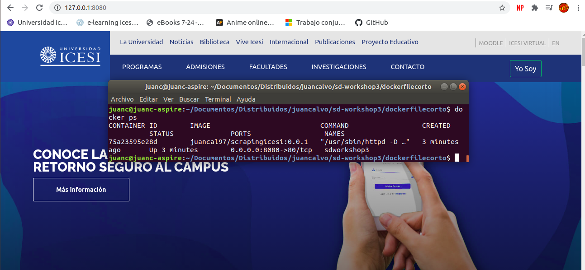
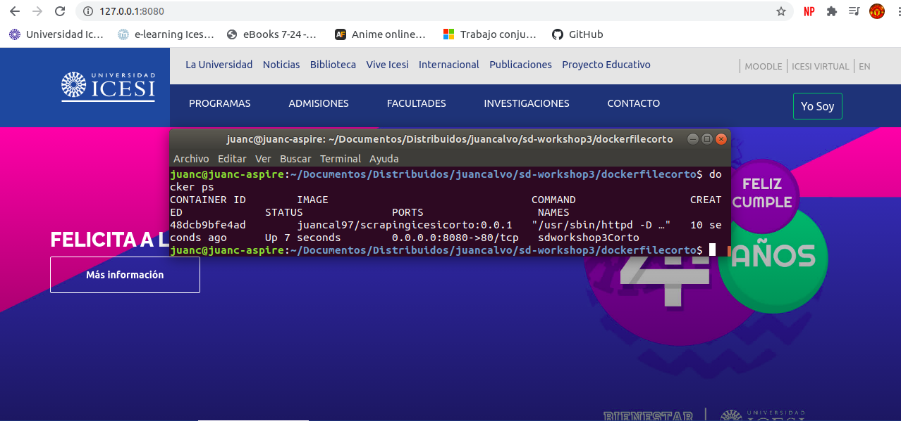

# sd-workshop3

1. Desplegar servidor web scraping icesi usando una imagen de alpine como base
2. Analizar pesos(MB) de imagenes cuando: Tenemos varios RUN en el dockerfile y cuando tenemos un solo RUN en el dockerfile
3. Decir las diferencias entre CMD y ENTRYPOINT

# Desarrollo

Para la realizacion del workshop3 crearon 2 dokerfiles, ambos con un imagen de alpine como base, pero el primer dockerfile que se encuentra en la carpeta princepal contiene 5 comandos RUN y el 2 dockerfile que se encuentra en la carpeta dokerfilecorto contiene tan solo 2 comandos RUN

Ya teniendo los dokerfiles hechos, se paso a crear la imagen con cada uno. En esta creacion se observo que la creacion del segundo dockerfile demoro un poco menos que la creacion del primero, ademas se observo que el tamaño de los contenedores era el mismo a pesar de que uno tuviera mas comandos RUN.

despues de creadas las 2 imagenes, se corrio uno a uno los contenedores y se probo ambos cumplieran con la tarea para la que fueron creados, la cual era realizar un web scraping de la pagina de la universidad icesi.

Contenedor con 5 comandos RUN

Contenedor con 2 comandos RUN

Por otra parte la diferencia entre CMD y ENTRYPOINT, es que: 

-	CMD define unos comandos y parametros predeterminados 	para 		el contenedor, los cuales se ejecutaran al iniciar el 		contenedor, estos comandos predeterminados pueden anularse 		facilmente por el usuario.

-	ENTRYPOINT tambien define unos comandos y parametros que se 		ejecutan al iniciar el contendedor, pero, con la diferencia 		que estas instrucciones no se podran anular almenos que se 		agregue una bandera --entrypoint
