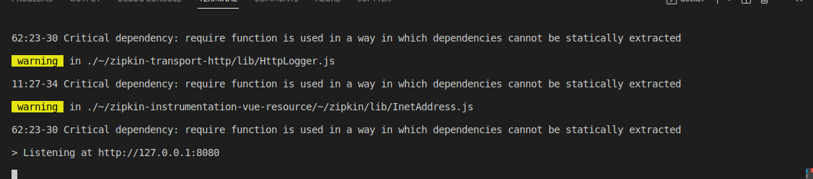
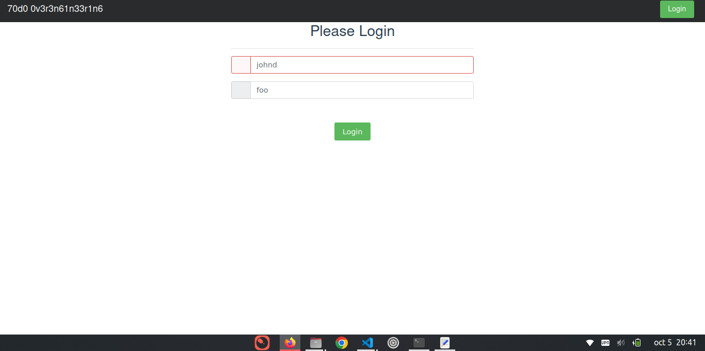

# sd-workshop3
Repor for workshop3
- Create dockerfile for the next code ->https://github.com/icesi-ops/microservice-app-example/tree/master/frontend and push it to dockerhub
- Create a README.md showing the execution of container (a screenshot say more than 1000 words)
- Make a pull request to this repo.

Juan David Ballesteros Workshop 3

Para correr la aplicación es necesario correr el siguiente comando
    `docker run -it -p 3000:8080 vue`

La imagen se encuentra en DockerHub en
    [Enlace al repositorio](https://hub.docker.com/repository/docker/juanballesteros/vue_distri)

> Para hacer pull
    `docker pull juanballesteros/vue_distri `   

Imagenes del funcionamiento de la aplicación

