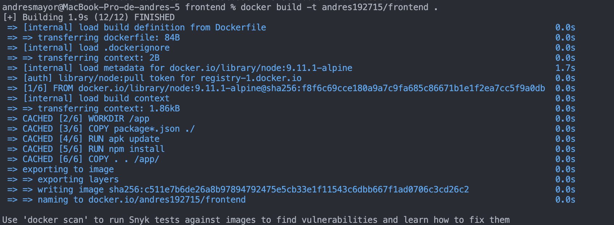
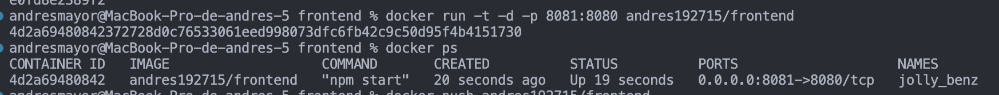
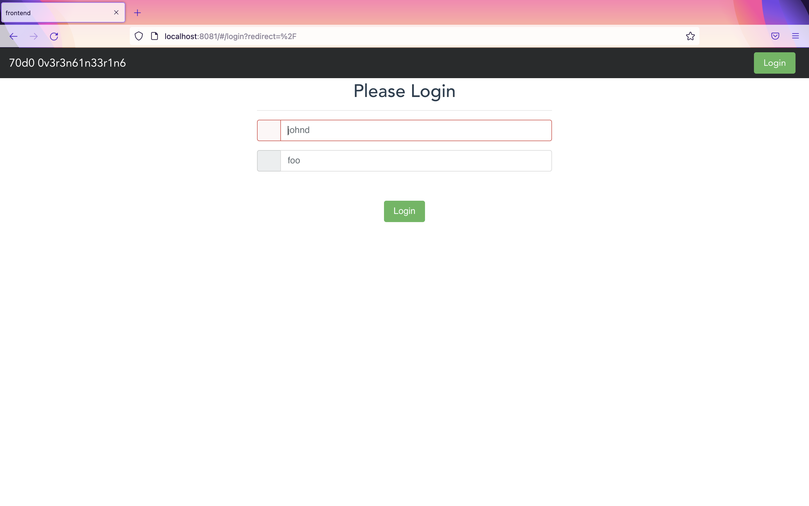

# sd-workshop3
Repor for workshop3
- Create dockerfile for the next code ->https://github.com/icesi-ops/microservice-app-example/tree/master/frontend and push it to dockerhub
- Create a README.md showing the execution of container (a screenshot say more than 1000 words)
- Make a pull request to this repo.

Due date 10/05/20222 at 8:30PM
## Developed by 🛠️
* **Jaime Andrés Mayor Aldana**  [AndresMayor](https://github.com/AndresMayor)🚀

# Cracion de la Imagen

# Terraform Plan

# Terraform Apply

La imagen se encuentra en un repositorio de DockerHub [Enlace Repositorio](https://hub.docker.com/repository/docker/andres192715/frontend)

