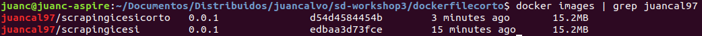

# sd-workshop3

1. Desplegar servidor web scraping icesi usando una imagen de alpine como base
2. Analizar pesos(MB) de imagenes cuando: Tenemos varios RUN en el dockerfile y cuando tenemos un solo RUN en el dockerfile
3. Decir las diferencias entre CMD y ENTRYPOINT

# Desarrollo

Para la realización del workshop3 se crearon 2 dokerfiles, ambos con un imagen de alpine como base, pero el primer dockerfile que se encuentra en la carpeta principal contiene 5 comandos RUN y el 2 dockerfile que se encuentra en la carpeta dokerfilecorto contiene tan solo 2 comandos RUN.

Ya teniendo los dokerfiles hechos, se pasó a crear la imagen con cada uno. En esta creacion se observó que la creación del segundo dockerfile demoró un poco menos que la creación del primero, adémas se observó que el tamaño de los contenedores era el mismo apesar de que uno tuviera más comandos RUN.

Imagénes de los contenedores

Después de creadas las 2 imagénes, se corrió uno a uno los contenedores y se probó que ambos cumplieran con la tarea, la cual era realizar un web scraping de la página de la Universidad Icesi.

Contenedor con 5 comandos RUN

Contenedor con 2 comandos RUN

Por otra parte la diferencia entre CMD y ENTRYPOINT, es que: 

-	CMD define unos comandos y parámetros predeterminados 	para 		el contenedor, los cuales se ejecutaran al iniciar el 		contenedor, estos comandos predeterminados pueden anularse 		fácilmente por el usuario.

-	ENTRYPOINT tambien define unos comandos y parámetros que se 		ejecutan al iniciar el contendedor, pero, con la diferencia 		que estas instrucciones no se podrán anular almenos que se 		agregue una bandera --entrypoint
