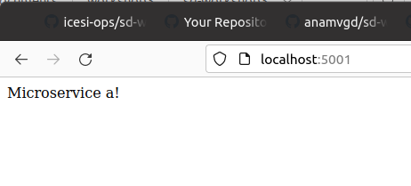
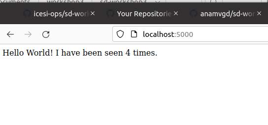
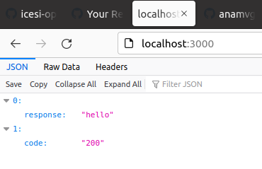
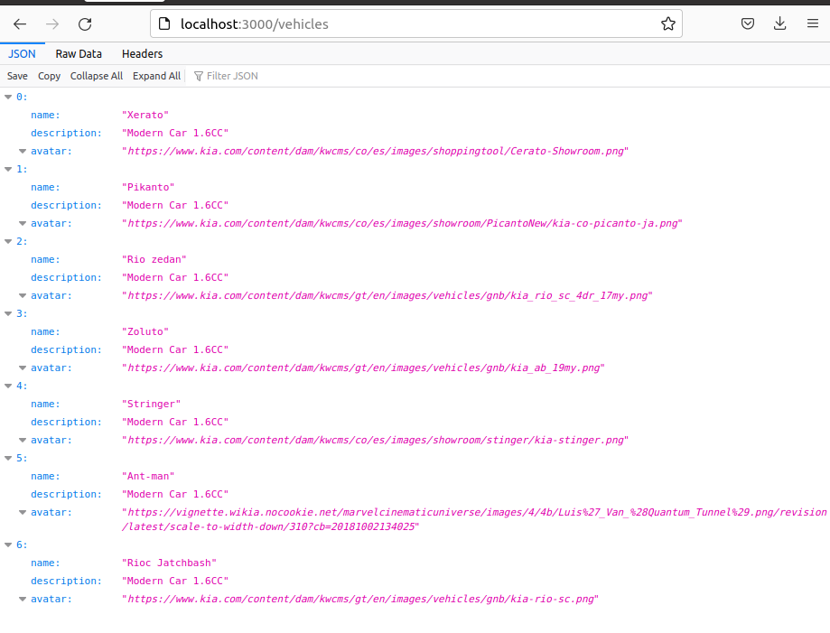
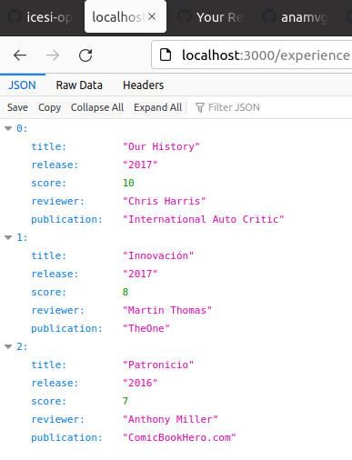
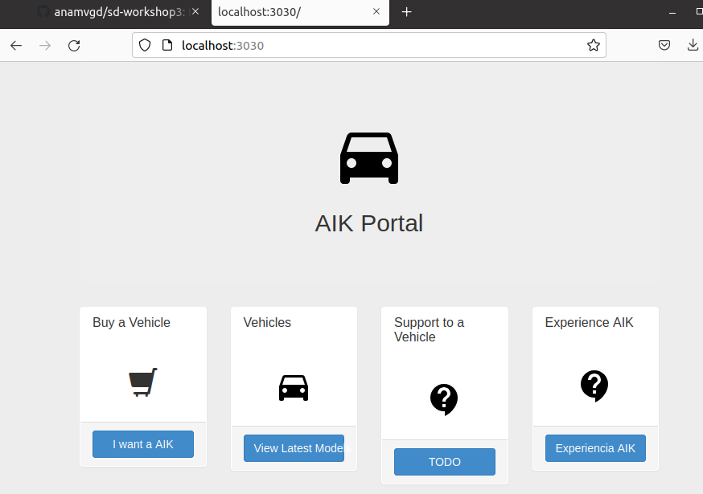

# Workshop 3

Executions and commands.

## Docker Python:helloworld

- Build docker file and run

```
docker build -t anamvgd/helloworld_python .
docker run -d -t -p 5001:5001 anamvgd/helloworld_python
```

- Running app



- Push to DockerHub: https://hub.docker.com/repository/docker/anamvgd/helloworld_python

## Docker Intro

- Build second docker file
```
docker build -t anamvgd/docker_intro .
```
- Create network intro
```
docker network create intro
```
- Running network and its image
```
docker run -t -d -p 5000:5000 --network=intro anamvgd/docker_intro
docker run --name redis -p 6379:6379 --network intro -d redis:alpine
```
- Running app:



- Push to DockerHub: https://hub.docker.com/repository/docker/anamvgd/docker_intro

## Docker aip app

- Build first image in aip-app
```
docker build -t anamvgd/aik-api .
```
- Running aip-api
```
docker run -d -t -p 3000:3000 anamvgd/aik-api
```







- Build second image aip-ui 
```
docker build -t anamvgd/aik-ui . 
```
- Running ui
```
docker run -d -t -p 3030:3030 anamvgd/aik-ui
```


- Push to DockerHub: https://hub.docker.com/repository/docker/anamvgd/aik-api and https://hub.docker.com/repository/docker/anamvgd/aik-ui 