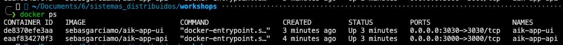
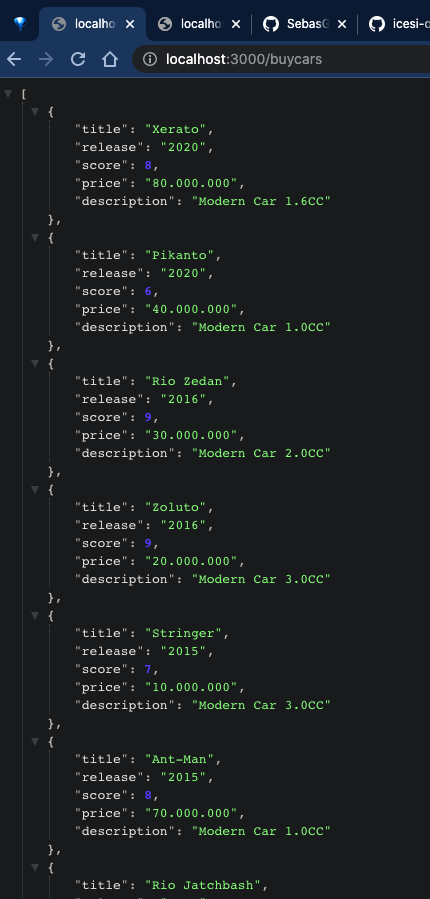
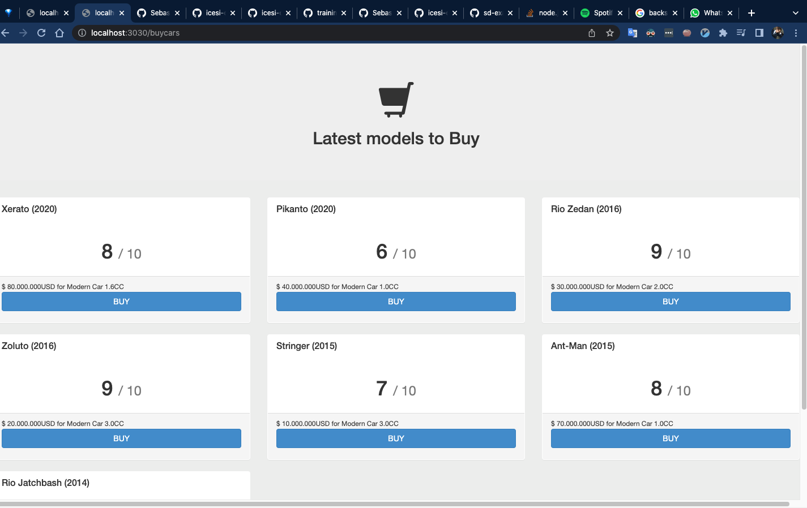
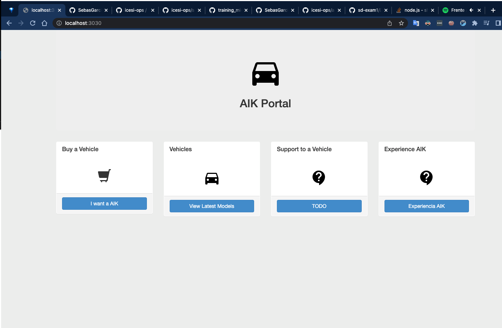
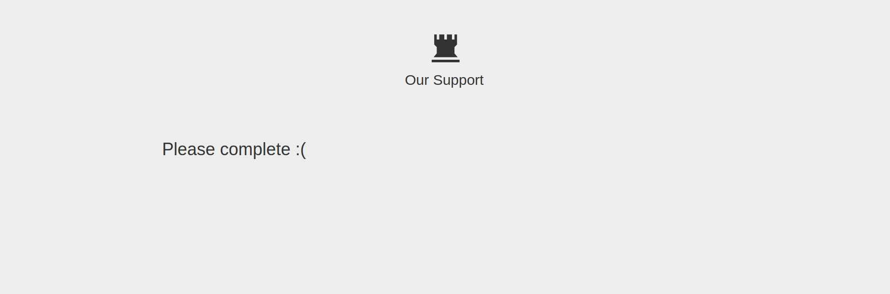

# Get started 

# Building (optional)
```bash
cd aik-app-api
docker build -t sebasgarciamo/aik-app-api .

cd aik-app-ui
docker build -t sebasgarciamo/aik-app-ui .
```

# Run containers 
```bash
docker pull sebasgarciamo/aik-app-api
docker pull sebasgarciamo/aik-app-ui

docker network create aik

docker run -p 3000:3000 \
    -e NODE_ENV=dev \
    -e PORT=3000 \
    --name aik-app-api \
    --hostname backend \
    --network aik \
    -d \
    sebasgarciamo/aik-app-api

docker run -p 3030:3030 \
    --name aik-app-ui \
    --hostname frontend \
    -e BACK_HOST=backend \
    --network aik \
    -d \
    sebasgarciamo/aik-app-ui
```

# Evidences

## Containers running


## API


## UI



# Aik-portal

Current State



Desired State

